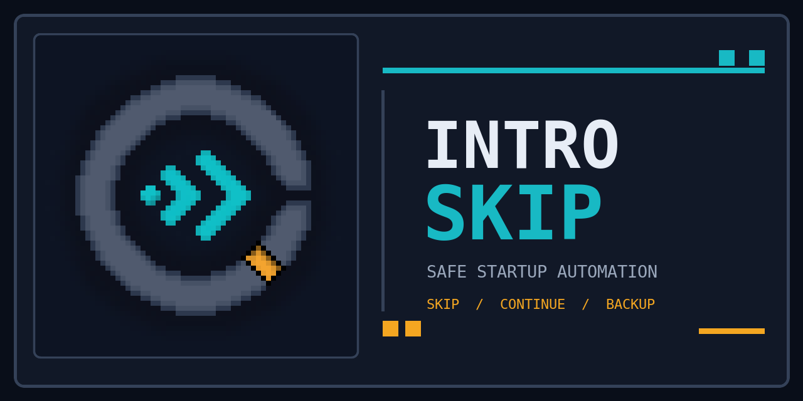

<div align="center">

# Intro Skip

Safe, configurable startup automation for **Teamfight Manager 2**.

**Intro Skip 0.5.4 · TFM2 0.5.7 · Windows**

</div>

## What it does

- Skips the startup disclaimer.
- Optionally selects **Continue** when the title screen is ready.
- Optionally accepts a mod-state mismatch only after creating and verifying a backup.
- Keeps managed backups for 3, 7, 14, or 30 days.
- Lets you import one of the five latest verified backups into the normal Load menu.
- Works with Better Mod Menu while retaining its native settings panel.

| Setting | Default |
| --- | --- |
| Skip disclaimer | On |
| Continue latest career | Off |
| Load through mod mismatch | Off |
| Backup retention | 7 days |

## Install

### Steam Workshop

[Subscribe to Intro Skip](https://steamcommunity.com/sharedfiles/filedetails/?id=3773405658),
enable it in the Mods screen, and restart when prompted.

### GitHub release

1. Download `tfm2-intro-skip-v0.5.4.zip` from
   [GitHub Releases](https://github.com/MadManPetr1/tfm2-intro-skip/releases).
   Do not use GitHub's automatic source-code archive.
2. Extract `tfm2_intro_skip` into:

   ```text
   ...\SteamLibrary\steamapps\common\Teamfight Manager2\mods\
   ```

3. Enable **Intro Skip** and restart the game.

The final folder must contain `tfm2_intro_skip\mod.mod_info` and
`tfm2_intro_skip\tfm2_intro_skip.dll`.

## Configure

Open **Mods**, select **Intro Skip**, and choose only the startup actions you
want. Settings are stored outside the Workshop folder so updates do not replace
them:

```text
%APPDATA%\TeamSamoyed\TeamfightManager2\data\tfm2_intro_skip\settings.json
```

Existing settings from `data\intro_skip\settings.json` or
`mods\intro_skip\settings.json` are migrated on first launch. Better Mod Menu
shows the same controls and recent-backup actions when
installed; Intro Skip still validates and performs every action itself.

## Backup protection

Before automatic **Load Anyway**, Intro Skip:

1. finds the latest career save;
2. copies it to `data\intro_skip_backups`;
3. verifies the copied size and contents;
4. continues only after verification succeeds.

Recovery remains manual. Diagnostic messages are written to
`data\tfm2_intro_skip\backup_status.log`.

> [!WARNING]
> A verified backup reduces recovery risk but cannot make incompatible mod
> combinations safe.

## Compatibility

- Teamfight Manager 2 `0.5.7`
- Windows
- Release DLL built against the `0.5.7` Mod SDK
- Automatic UI actions require the window title `Teamfight Manager2`

## Build and support

The Mod SDK is not redistributed. With a matching SDK installed:

```powershell
.\build_local.ps1 -SdkDir "C:\path\to\Teamfight Manager2\mod-sdk-0.5.7"
.\scripts\validate_repo.ps1
.\scripts\package_release.ps1 -SdkDir "C:\path\to\Teamfight Manager2\mod-sdk-0.5.7"
```

For a bug report, include the game/mod versions, enabled mods, the exact point
where startup stopped, and relevant sanitized `backup_status.log` lines. Never
upload personal save files publicly.

## License

Source code, scripts, and documentation are licensed under the
[Mozilla Public License 2.0](LICENSE). Original project branding and artwork
are not covered by MPL-2.0; see [NOTICE.md](NOTICE.md).

This independent community mod is not affiliated with or endorsed by Team
Samoyed.
